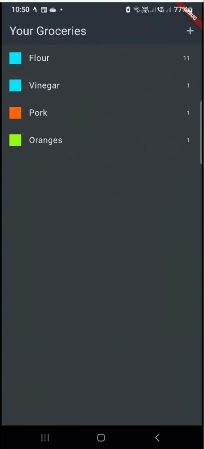
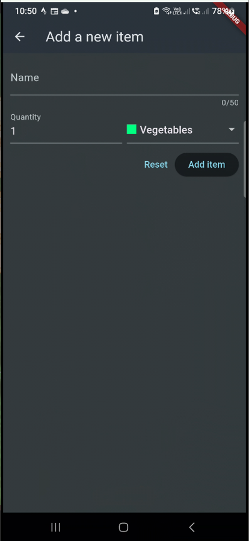
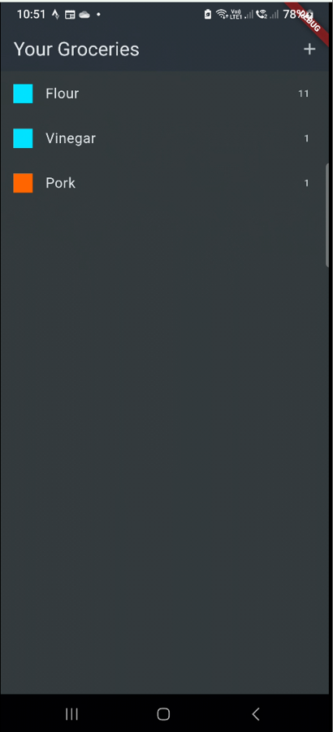

# The Grocery List App
 

## About:
Allows users to add items to a grocery list. Each item can be categorized under a label.
## Features:
  - saves the items to a database
  - creates a useful shopping list

## Packages Used:
  - HTTP
  - Convert

## Images:
<table>
  <tr>
    <th>Screen Name</th>
    <th>Screenshot</th>
  </tr>
  <tr>
    <td><strong>Home Screen</strong></td>
    <td></td>
  </tr>
  <tr>
    <td><strong>Add Item</strong></td>
    <td></td>
  </tr>
  <tr>
    <td><strong>Removed an Item</strong></td>
    <td></td>
  </tr>
</table>
